# 🔄 CARLA Autonomous Driving - Project Workflow

This document provides a comprehensive overview of the project's workflow, including system architecture, training pipeline, and inference execution.

---

## 📊 Table of Contents

- [System Overview](#-system-overview)
- [Training Workflow](#-training-workflow)
- [Inference Workflow](#-inference-workflow)
- [XAI Pipeline](#-xai-pipeline)
- [Component Interaction](#-component-interaction)
- [Data Flow](#-data-flow)

---

## 🎯 System Overview

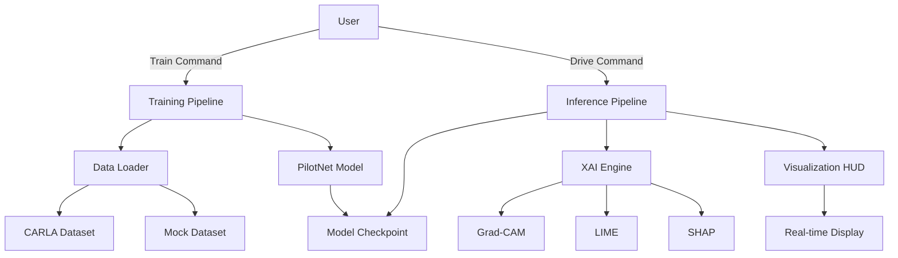

**Key Components:**
- **Training Pipeline**: Handles model training and evaluation
- **Inference Pipeline**: Runs autonomous driving with predictions
- **XAI Engine**: Generates explanations for model decisions
- **Visualization**: Real-time HUD with attention maps

---

## 🎓 Training Workflow

### High-Level Training Flow

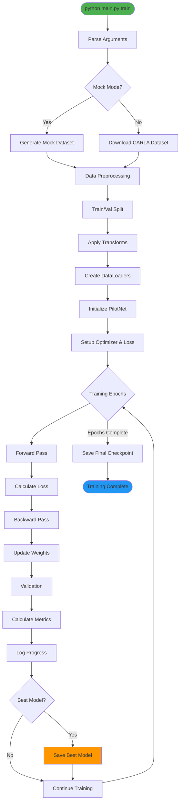

### Detailed Training Steps

1. **Initialization**
   - Parse command-line arguments
   - Set device (GPU/CPU)
   - Initialize random seeds for reproducibility

2. **Data Loading**
   ```
   Option A: Mock Mode
   └── Generate synthetic dataset (100 samples)
   
   Option B: Full Dataset
   ├── Download CARLA dataset from HuggingFace
   ├── Cache locally for future runs
   └── Load training and validation splits
   ```

3. **Preprocessing**
   - Resize images to 66x200 (PilotNet input size)
   - Normalize pixel values to [0, 1]
   - Convert to PyTorch tensors
   - Normalize controls (steering, throttle, brake)

4. **Model Training Loop**
   ```
   For each epoch:
   ├── Training Phase
   │   ├── Forward pass: predictions = model(images)
   │   ├── Compute loss: MSE(predictions, ground_truth)
   │   ├── Backward pass: loss.backward()
   │   └── Update weights: optimizer.step()
   │
   └── Validation Phase
       ├── Evaluate on validation set
       ├── Calculate metrics (MSE, MAE, F1)
       └── Save best model if improved
   ```

5. **Metrics Calculation**
   - **MSE**: Mean Squared Error for regression accuracy
   - **MAE**: Mean Absolute Error for average deviation
   - **F1 Score**: Discretized classification performance

6. **Model Saving**
   - Best model: Saved when validation loss improves
   - Final model: Saved at end of training
   - Checkpoints include: model weights, optimizer state, epoch number

---

## 🚗 Inference Workflow

### High-Level Inference Flow

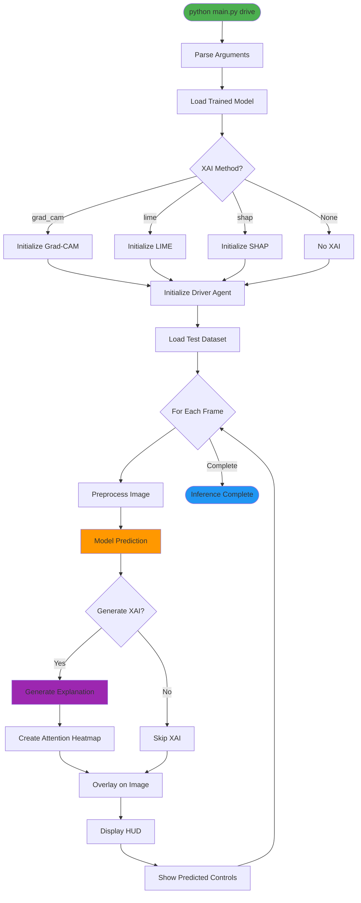

### Detailed Inference Steps

1. **Model Loading**
   ```python
   model = PilotNet()
   checkpoint = torch.load(model_path)
   model.load_state_dict(checkpoint['model_state_dict'])
   model.eval()
   ```

2. **XAI Initialization**
   - **Grad-CAM**: Extract target convolutional layer
   - **LIME**: Initialize image explainer with segmentation
   - **SHAP**: Create deep explainer with background samples

3. **Frame Processing Loop**
   ```
   For each frame:
   ├── Load image from dataset
   ├── Preprocess (resize, normalize)
   ├── Model inference: controls = model(image)
   ├── Generate XAI explanation (if enabled)
   ├── Create visualization overlay
   └── Display on HUD
   ```

4. **Prediction Extraction**
   ```python
   outputs = model(image_tensor)
   steering = outputs[0, 0]
   throttle = outputs[0, 1]
   brake = outputs[0, 2]
   ```

5. **Real-time Display**
   - Original image with XAI overlay
   - Steering wheel indicator
   - Numerical control values
   - FPS counter

---

## 🔍 XAI Pipeline

### XAI Methods Comparison

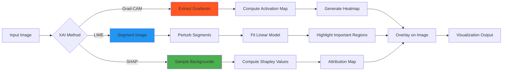

### Grad-CAM Workflow

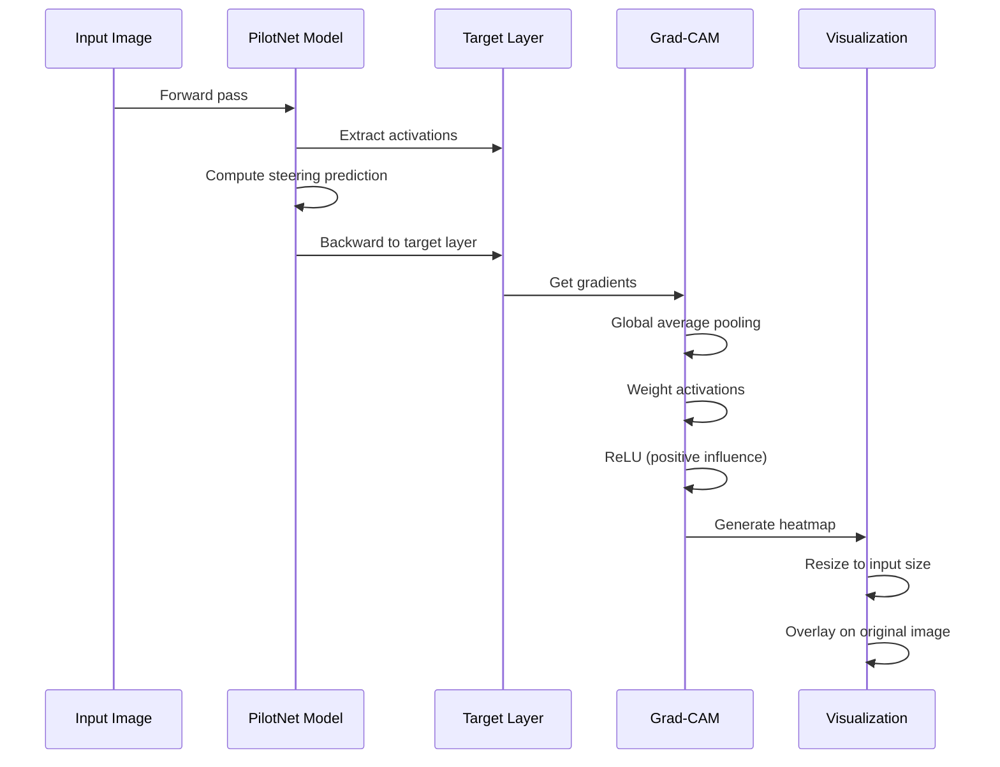

### LIME Workflow

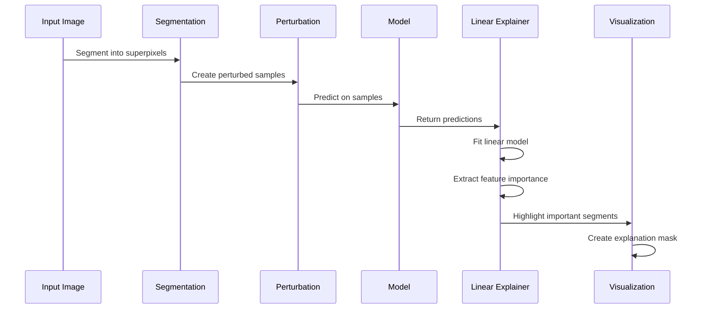

### SHAP Workflow

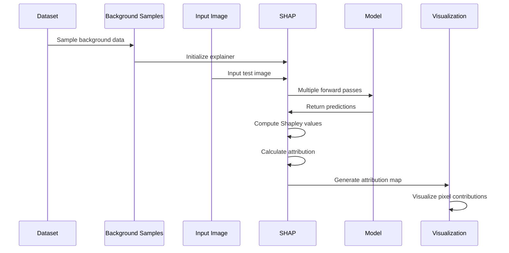

---

## 🔗 Component Interaction

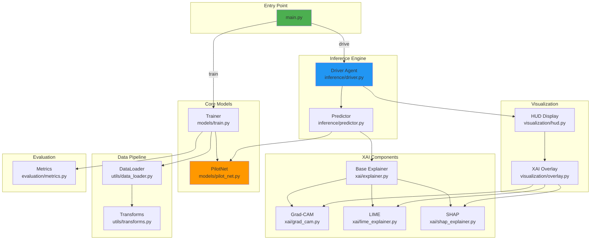

---

## 📈 Data Flow

### Training Data Flow

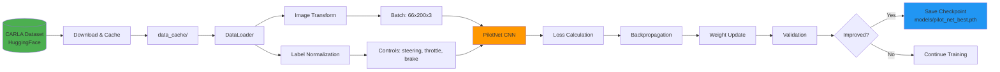

### Inference Data Flow

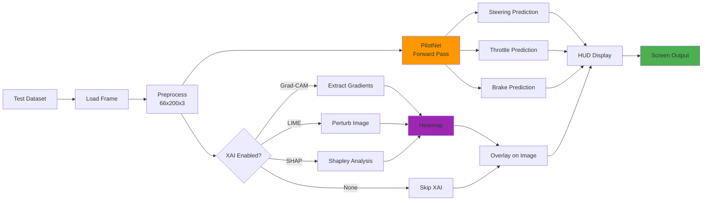

---

## 🎮 Usage Flow

### Quick Start Flow

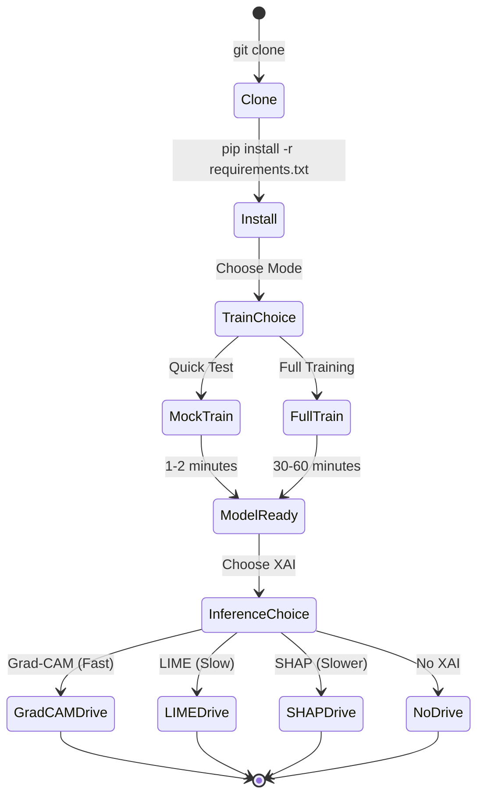

---

## 📋 Command Flow Summary

### Training Command Flow
```bash
python main.py train --epochs 10 --batch_size 32
    ↓
Parse arguments
    ↓
Load/Download dataset
    ↓
Initialize PilotNet model
    ↓
Training loop (10 epochs)
    ↓
Save best model → models/pilot_net_best.pth
```

### Inference Command Flow
```bash
python main.py drive --xai grad_cam
    ↓
Load trained model
    ↓
Initialize Grad-CAM explainer
    ↓
Load test images
    ↓
For each frame:
    - Predict controls
    - Generate heatmap
    - Display HUD
```

---

## 🔄 Continuous Workflow

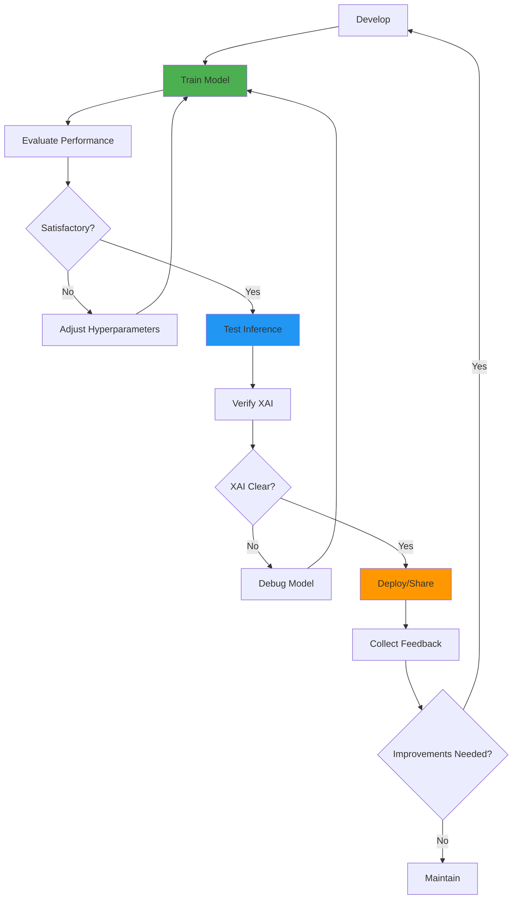

---

## 🎯 Key Takeaways

1. **Modular Design**: Each component (model, XAI, visualization) is independent
2. **Two Main Modes**: Training (batch processing) and Inference (real-time)
3. **Flexible XAI**: Choose from multiple explanation methods based on needs
4. **Efficient Pipeline**: Mock mode for quick testing, full mode for production
5. **Clear Data Flow**: Raw data → Processing → Model → Predictions → Visualization

---

**For more details on specific components, refer to the [README.md](README.md)**
